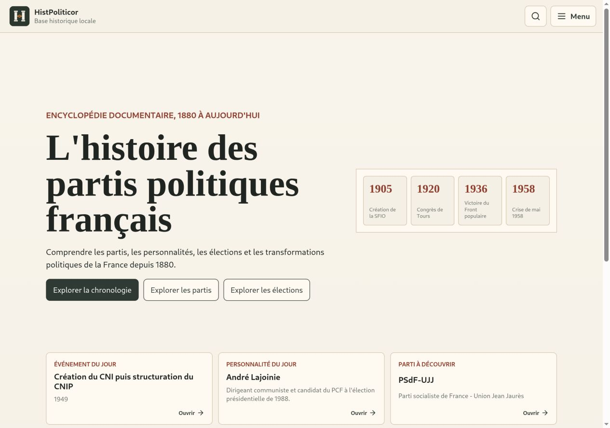
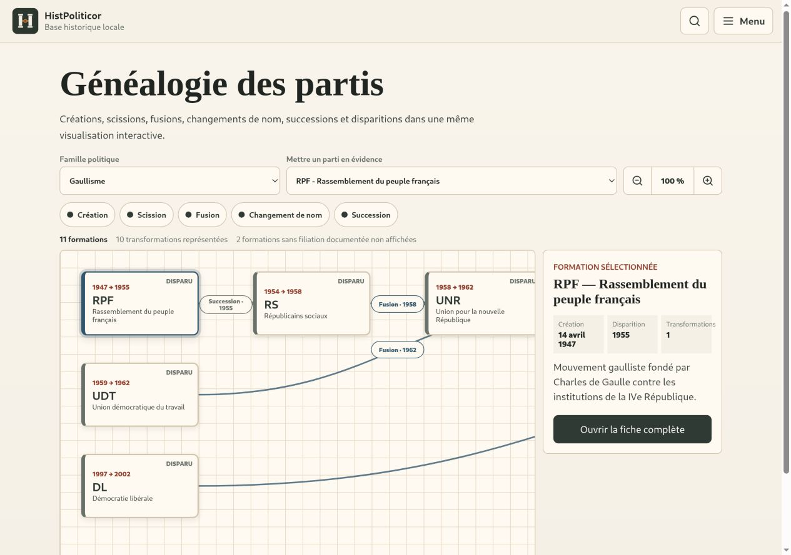
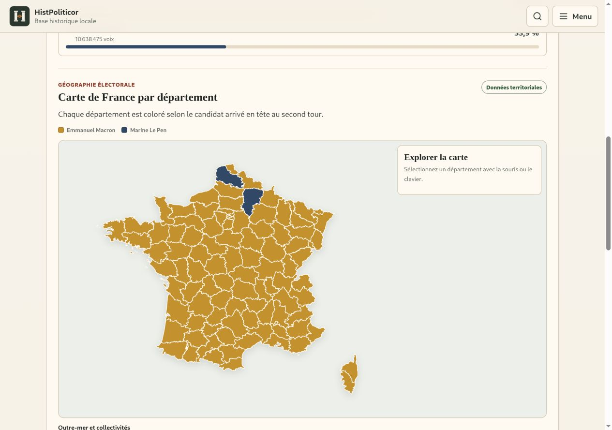

# HistPoliticor

HistPoliticor est une application web progressive consacrée à l'histoire des partis, mouvements, coalitions et personnalités politiques françaises, de 1880 à aujourd'hui.

Le projet privilégie un dataset historique local, relationnel et traçable : les partis, personnes, élections, événements, familles politiques et sources sont consultables séparément et reliés entre eux.

## Captures d’écran

### Accueil



### Généalogie des partis



### Carte électorale



## Fonctionnalités principales

- chronologie interactive générée à partir des événements, élections, partis et relations ;
- accueil dynamique renouvelé chaque jour à partir du corpus, avec anniversaires historiques, rotation de 10 citations issues de sources primaires et jalons annuels cliquables ;
- arbre généalogique interactif des partis, filtrable par famille politique et par transformation (création, scission, fusion, changement de nom ou succession), avec zoom et fiches contextuelles ;
- filtres par orientation politique et type d'événement ;
- fiches événement reliant élections, créations de partis, scissions, fusions, changements de nom, présidents, gouvernements, crises, référendums et guerres ;
- fiches de partis, personnalités et élections avec navigation relationnelle et résultats électoraux sourcés ;
- dossiers électoraux complets : dates et tours, type de scrutin, contexte politique et économique, candidats, partis, résultats, participation, abstention, voix du second tour, effectif de l'Assemblée, conséquences, réformes et crises ultérieures ;
- cartes de France interactives par département pour 24 seconds tours présidentiels et législatifs, calculées à partir des données ouvertes de Sciences Po et du ministère de l'Intérieur ;
- 151 biographies enrichies à partir de Wikipédia et Wikidata : récit biographique, lieux de naissance et de décès, nationalité, activités, formation, appartenances politiques et mandats datés ;
- 139 portraits libres de personnalités servis localement, avec crédits Wikipédia/Wikimedia Commons ;
- corpus de crises typées avec leurs conséquences et leurs sources ;
- 52 logos libres servis localement, avec crédits et licences Wikimedia Commons ;
- recherche locale, favoris et fonctionnement PWA hors ligne.
- identité visuelle PWA dédiée, avec favicon, icône iOS et icônes installables standard et maskable.
- menu hamburger accessible, organisé par exploration historique, acteurs politiques et documentation.
- page Paramètres affichant la version et sa date de build, avec vérification manuelle ou automatique des mises à jour PWA.

## Installation

```bash
npm install
npm run dev
```

L'application est alors disponible sur l'URL affichée par Vite, généralement `http://localhost:5173`.

## Scripts

```bash
npm run validate:data
npm run test
npm run build
npm run preview
npm run fetch:party-logos -- --download
npm run fetch:person-portraits -- --download
npm run fetch:person-profiles -- --download
ELECTION_SOURCE_DIR=/chemin/vers/les-archives npm run generate:election-maps
```

`npm run preview` sert localement le build de production.
`fetch:party-logos` récupère la sélection contrôlée de logos depuis Wikimedia Commons, vérifie leur licence, les stocke dans `public/logos/parties` et régénère leurs crédits dans `src/data/partyLogos.ts`.
`fetch:person-portraits` rapproche les personnalités avec Wikidata en contrôlant leur date de naissance, récupère les portraits libres de Wikipédia/Wikimedia Commons, les stocke dans `public/images/persons` et régénère les crédits dans `src/data/personPortraits.ts`.
`fetch:person-profiles` récupère l'introduction encyclopédique française et les informations structurées de Wikidata pour les 151 personnalités, contrôle leur identité et régénère `src/data/personProfiles.ts` avec les sources, la licence et la date de récupération.

La version de l'application provient de `package.json`. Vite l'injecte dans l'interface et génère `version.json` avec la date du build. Par défaut, l'application vérifie ce fichier au démarrage, lorsqu'elle redevient visible, au retour du réseau et toutes les 30 minutes. Le réglage peut être désactivé dans « Paramètres ».

## Structure

```text
src/
  data/       Données historiques locales, portraits, logos et profils enrichis
  lib/        Navigation relationnelle, mises à jour PWA et moteur de généalogie
  styles/     Interface mobile-first
  types/      Modèle éditorial et relationnel
scripts/      Validation du dataset
public/       Manifest, service worker, icônes, logos, portraits locaux et page hors ligne
```

## Données

Les données principales sont locales et séparées des composants React. Les relations entre entités sont des données de première classe.

État actuel du corpus : 109 partis et mouvements, 151 personnalités, 43 élections, 185 événements et 177 sources. La chronologie commence en 1880 afin de contextualiser les organisations apparues avant 1900.

Le corpus couvre notamment les recompositions suivantes :

- structuration des partis de la IIIe République et de la SFIO ;
- scission de Tours, Front populaire et recompositions de l'après-guerre ;
- IVe République, gaullisme, Ve République et décolonisation ;
- recompositions des années 1970 à 1990 : PS, PCF, UDF, RPR, FN, écologie et souverainisme ;
- alternances et cohabitations des années 1990 et 2000 ;
- UMP/LR, LREM, LFI, EELV, RN et nouveaux mouvements depuis 2010.

Les associations, ligues et coalitions sont conservées lorsqu'elles jouent un rôle historique important, avec un `status` explicite afin de ne pas les confondre avec des partis.

La rubrique « Généalogie des partis » transforme les relations historiques en graphe orienté de gauche à droite. Le courant gaulliste y suit notamment RPF → Républicains sociaux → UNR, la fusion UNR + UDT → UNR-UDT, puis UDR → RPR → UMP → LR. Les branches, comme la scission du RPF souverainiste en 1999, et les apports extérieurs, comme Démocratie libérale lors de la création de l'UMP, restent visibles.

Les champs éditoriaux techniques tels que `importance`, `category` et `dataStatus` restent dans le modèle et servent à la structuration ou à la validation. Ils ne sont pas affichés comme tels dans les fiches publiques.

Les fiches électorales distinguent les informations absentes des informations qui ne s'appliquent pas au scrutin. Un référendum ou une élection européenne à un tour affiche ainsi « sans second tour » ; un scrutin qui ne renouvelle pas l'Assemblée indique « non applicable » pour les sièges, sans masquer la rubrique. Les résultats territoriaux sont chargés à la demande afin de ne pas alourdir l'accueil.

Les cartes utilisent le fond simplifié des départements publié par Etalab sous Licence Ouverte. Les présidentielles de 1965 à 2012 et les législatives de 1958 à 2012 sont agrégées depuis les jeux ODbL du Centre de données sociopolitiques de Sciences Po ; les scrutins de 2017 utilisent les fichiers définitifs du ministère de l'Intérieur sur data.gouv.fr. Pour les législatives, la couleur indique le bloc politique arrivé en tête en additionnant les voix des circonscriptions du département appelées à voter au second tour. Pour une élection à un tour, aucune carte de second tour artificielle n'est produite.

## Logos et crédits

La page « Partis et mouvements » utilise les logos libres dont l'identification a pu être contrôlée. Les formations sans fichier libre suffisamment fiable utilisent un monogramme neutre ; aucun logo n'est inventé ou associé automatiquement à partir du seul sigle.

Les fichiers sont conservés dans `public/logos/parties`. Les métadonnées générées dans `src/data/partyLogos.ts` enregistrent la page Commons, l'auteur, la licence et la date de récupération. Les crédits complets sont accessibles sous la grille des partis. La licence d'un fichier ne supprime pas les éventuels droits de marque attachés au logo.

## Portraits, biographies et crédits

Les fiches « Personnalités » affichent l'un des 139 portraits locaux lorsque l'identité a pu être contrôlée avec le nom et la date de naissance. Chaque fiche donne accès à l'image Commons, à son auteur, à sa licence et à la notice Wikipédia correspondante. En l'absence d'association certaine ou de licence libre reconnue, un monogramme neutre est conservé.

Les 151 fiches comportent aussi un profil biographique enrichi : l'introduction de la notice Wikipédia française, les lieux de naissance et de décès, la nationalité, les activités, la formation, les appartenances politiques et les fonctions ou mandats datés disponibles dans Wikidata. La provenance, la licence Creative Commons et la date de récupération sont affichées sur chaque fiche. Ces informations complètent le résumé éditorial local sans remplacer les relations historiques propres à HistPoliticor.

## Données électorales et cartographiques

Les agrégations de `src/data/electionTerritorialResults.generated.json` dérivées des jeux Sciences Po/CDSP sont diffusées selon l'Open Data Commons Open Database License (ODbL). Les résultats 2017 du ministère de l'Intérieur et le fond départemental Etalab sont sous Licence Ouverte. Les producteurs, pages de téléchargement et licences sont enregistrés dans `src/data/sources.ts` et affichés sur les fiches.

Le générateur `scripts/generate-election-territorial-results.ts` accepte `ELECTION_SOURCE_DIR` pour désigner un répertoire contenant les archives sources décompressées. Il répare seulement les décalages numériques documentés du CSV 1978, agrège les circonscriptions ou bureaux au département et ne modifie pas les résultats politiques.

Pour ajouter une fiche :

1. Ajouter l'entité dans `src/data/core.ts` ou `src/data/documents.ts`.
2. Ajouter ses sources dans `src/data/sources.ts`.
3. Ajouter les relations utiles dans `relations`.
4. Ajouter un logo à la sélection contrôlée de `scripts/fetch-party-logos.ts` si un fichier Commons libre et non ambigu existe.
5. Régénérer les portraits avec `npm run fetch:person-portraits -- --download` après l'ajout d'une personnalité.
6. Régénérer les profils avec `npm run fetch:person-profiles -- --download` après l'ajout d'une personnalité.
7. Lancer `npm run validate:data`.

Ne pas intégrer de résultat électoral, citation ou date précise sans source vérifiable. Les marqueurs de travail comme `TODO_DATA` ou `NEEDS_SOURCE` ne doivent jamais être placés dans les champs éditoriaux affichables ; une limite de couverture doit être formulée publiquement et précisément, puis suivie séparément dans le travail éditorial.

Les listes historiques fournies comme matériau de travail peuvent contenir des anachronismes ou des approximations. Ils doivent être corrigés dans `historicalNote` et ne doivent pas être propagés silencieusement dans les données.

## Qualité et tests

Avant toute contribution :

```bash
npm run validate:data
npm run test
npm run build
```

Le validateur contrôle notamment les identifiants en double, les références cassées, les sources absentes et les dates invalides.

## Contribution éditoriale

Les modifications doivent rester ciblées, documenter les incertitudes et conserver les sources existantes. Une nouvelle relation doit être ajoutée seulement lorsqu'elle apporte une information historique identifiable : fondation, scission, fusion, changement de nom, alliance ou succession.

## Déploiement Netlify

`netlify.toml` configure le build Vite, les routes SPA et les headers de base. La commande de production est `npm run build`, avec publication du dossier `dist`.
